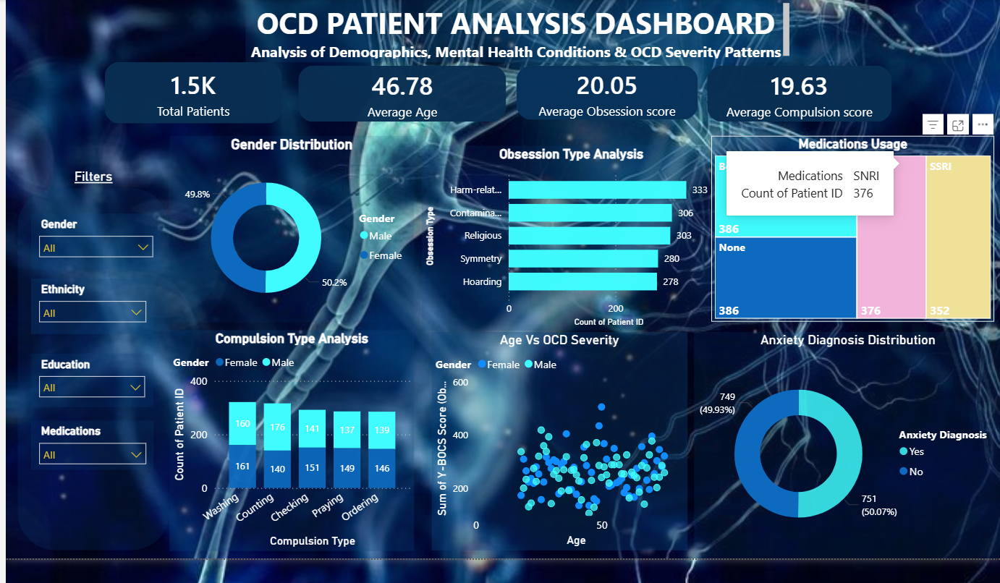

# OCD Patient Analysis Dashboard

## Overview
This project is an interactive Power BI dashboard created to analyze OCD patient data. The dashboard provides insights into demographics, obsession patterns, compulsion behavior, anxiety diagnosis, medication usage, and OCD severity.

## Tools Used
- Microsoft Power BI
- CSV Dataset
- Data Visualization

## Dashboard Features
- Total patient count
- Average age analysis
- Average obsession score
- Average compulsion score
- Gender distribution
- Anxiety diagnosis analysis
- Obsession type analysis
- Compulsion type analysis
- Medication usage visualization
- OCD severity analysis
- Age vs OCD severity analysis

## Visualizations Included
- Cards
- Donut Charts
- Column Charts
- Stacked Bar Charts
- Treemap
- Scatter Plot
- Slicers

## Dashboard Preview

## Skills Demonstrated
- Data Cleaning
- Data Visualization
- Dashboard Design
- Data Storytelling
- Business Intelligence
- Interactive Reporting

## Project Objective
The objective of this project is to analyze OCD patient data using Power BI and generate meaningful healthcare insights through interactive dashboards.

## Author
Anusha Vijayan
